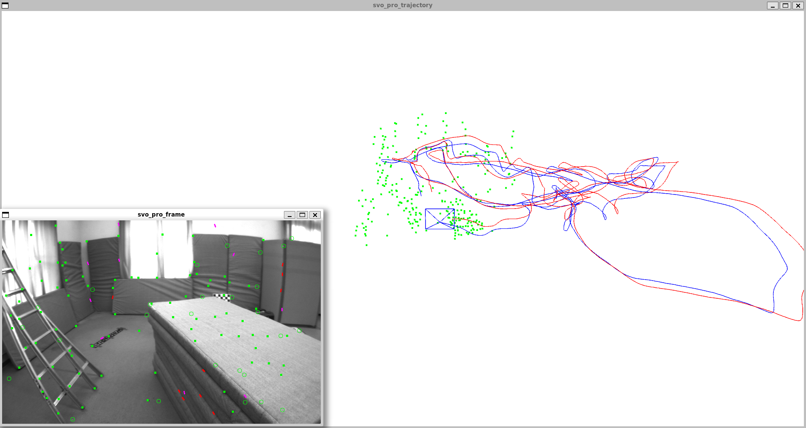

# svo_pro_universal

This repo is the plain CMake version for [rpg_svo_pro_open](https://github.com/uzh-rpg/rpg_svo_pro_open). Check the original repo for detail.

**Check branch [wasm](https://github.com/Jianxff/svo_pro_universal/tree/wasm) for WebAssembly version (odometry only).**

And now it supports:
- mono/stereo visual-odometry
- mono/stereo visual-intertial-odometry

What is on working:
- mono/stereo visual-intertial-SLAM
- mono/stereo visual-intertial-SLAM with loop closure

**No Bundle-Adjustment**.
**Still on working**.

Ceres backend are not integrated into the system yet.

The core codes for compile are in `src/` folder. 
And the `extra/` folder includes the additional parts which are not integrated into current system.


#### notes
The main system APIs can be founded in `src/svo/svo_factory.h`

EuRoC example can be found in `examples/`

Pangolin is used for lightweight visualization. Codes for simple viewer are in `src/visualize`

Type `GLOG_v=${level}` as command prefix to set glogv level.


#### install
Make sure you have installed:
- OpenCV 4.x
- Eigen 3.4.0
- OpenGV
- Ceres-Solver
- Glog
- yaml-cpp
- pangolin

Then run the following commands:
```sh
# clone the repo
cd svo_pro_universal

mkdir build
cd build

cmake ..
make -j4
```


#### test on EuRoC
test for monocular
```sh
cd build/examples
GLOG_v=100 ./euroc_mono ../../examples/param/calib/euroc_mono.yaml ../../examples/param/pinhole.yaml ~/dataset/euroc/V101/mav0/
```

test for monocular-intertial
```sh
cd build/examples
GLOG_v=100 ./euroc_mono_imu ../../examples/param/calib/euroc_mono.yaml ../../examples/param/pinhole_fixed.yaml ~/dataset/euroc/V101/mav0/
```

#### preview


*\*The blue line is the poses estimated by frames (with imu prior) and the red line is the poses estimated by imu data*