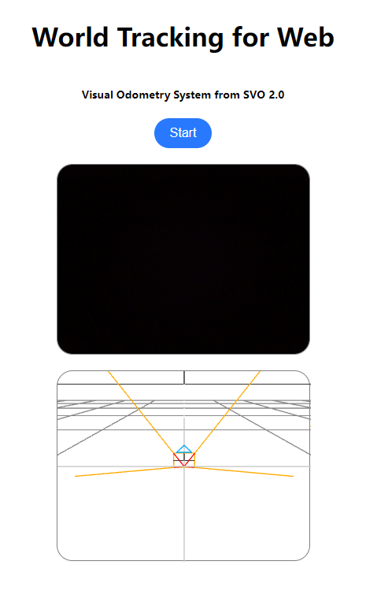

# svo_pro_wasm

This branch is the **WebAssembly** version for [rpg_svo_pro_open](https://github.com/uzh-rpg/rpg_svo_pro_open). Check the original repo for detail.

And now it supports:
- mono visual-odometry
- mono visual-intertial-odometry

**No bundle-adjustment**.  
**Single-Thread**.  
**Still on working**.

For sturcture or sysetm details, check the `main` branch.

The wrapper codes for javascript are under `src/svo_js` folder.

#### notes
The odometry system can work either on **WebWorker** or main-thread.

Check `src/svo_js/export.js` for importing and API calls.

A simple example can be found under `examples/`
  

#### install
Make sure you have installed:
- OpenCV 4.x
- Eigen 3.4.0
- OpenGV
- Ceres-Solver

And build them with [emscripten](https://emscripten.org/).

And install them to the emsdk dir.

Then run the following commands:
```sh
# clone the repo
cd svo_pro_universal
git checkout origin/wasm

mkdir build
cd build

# activate emsdk
source /path/to/emsdk/emsdk_env.sh

emcmake cmake ..
emmake make -j4
```

#### preview
